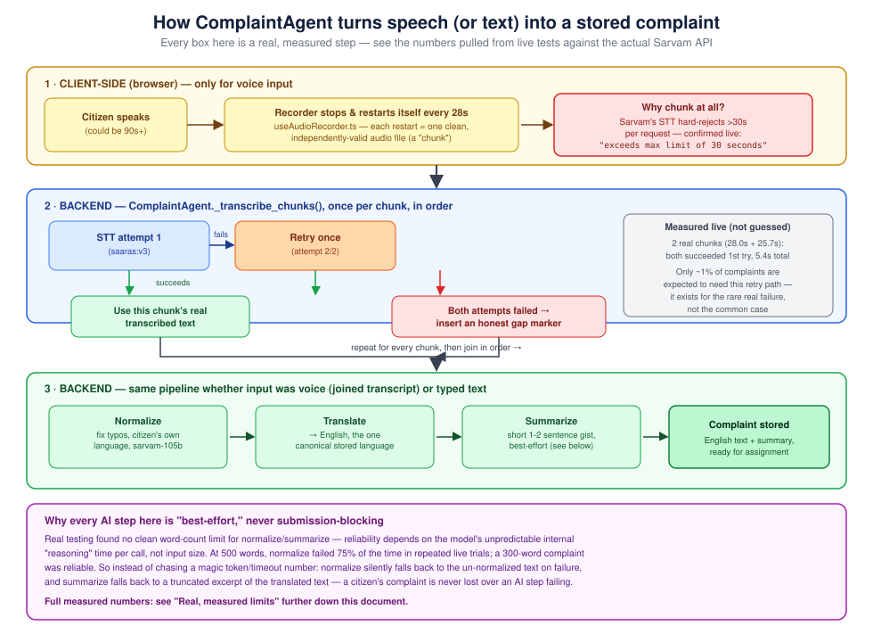

# The AI Agent — How JanSarthi AI Actually Uses AI

*Written so it makes sense whether or not you write code. If a term might be unfamiliar, it's explained the first time it shows up, and again in the [Glossary](#glossary-plain-language) at the bottom.*

> Part of the JanSarthi AI documentation set. Start at [`README.md`](../README.md) for the big picture, or [`PROJECT_OVERVIEW.md`](PROJECT_OVERVIEW.md) for a full tour of the whole codebase. This document is the deep dive on just one piece: the AI pipeline.

---

## 1. What "the AI agent" means here

When people say "AI agent" they can mean very different things — a chatbot, a fully autonomous robot that plans its own actions, or (what this actually is) **a piece of code that calls an AI company's API a few times, in a fixed order, to turn one kind of information into another.**

In this codebase, the agent is a Python class called `ComplaintAgent` ([`backend/services/complaint_agent.py`](../backend/services/complaint_agent.py)). Its job, every single time a citizen submits a complaint, is:

1. If it's a voice complaint: turn the spoken audio into text.
2. Fix any typos or slips of the tongue.
3. Translate it into English (the one language everything is stored in internally).
4. Write a short 1–2 sentence summary, so a worker skimming a long list doesn't have to read every full complaint.
5. Save the result to the database.

None of these steps involve JanSarthi AI *training* an AI model. All the actual "intelligence" comes from **Sarvam AI**, an Indian AI company whose models specialize in Indian languages. This codebase just calls their API, in a specific order, and handles it sensibly when a call fails. If you're wondering how this compares to *building* a generative AI model from scratch — it doesn't; it's an *AI-powered application*, which is what the overwhelming majority of real-world "AI products" actually are. See [§6](#6-what-this-is-and-isnt--a-note-on-scope) for that distinction spelled out properly.

---

## 2. The pipeline, visually

Everything in that diagram is described in the sections below, in the same order top to bottom.

---

## 3. Step by step

### 3.1 Speech-to-text (STT) — turning a voice recording into text

Only runs if the citizen used voice input (not typing). Calls Sarvam's `saaras:v3` model.

**The single most important fact about this step:** Sarvam's speech-to-text endpoint **hard-rejects any single request over 30 seconds of audio.** This isn't a guess or something read off a docs page — it was confirmed by actually sending real audio files of increasing length to the live API:

| Audio length sent | Result |
|---|---|
| 10 seconds | ✅ Accepted |
| 30 seconds | ✅ Accepted |
| 35 seconds | ❌ Rejected |
| 60 seconds, 2 min, 5 min, 10 min | ❌ Rejected (same error every time) |

The rejection is immediate and explicit:
> `Audio duration exceeds the maximum limit of 30 seconds. Please use the batch API for longer audio files.`

A real citizen describing a problem out loud will very often talk for longer than 30 seconds — people ramble, especially when frustrated about something like garbage piling up for a week. A hard 30-second cutoff would mean the app breaks for exactly the citizens it's supposed to serve best. So instead of accepting that limit, the recording gets **split into pieces**:

- The browser ([`useAudioRecorder.ts`](../frontend-react/src/lib/useAudioRecorder.ts)) stops and immediately restarts the microphone recorder every **28 seconds** (2 seconds of safety margin under the 30s cap). Each restart produces a brand-new, independently-valid audio file — like recording several short voice notes back-to-back instead of one long one, except the citizen never notices any of this; from their side it just feels like one continuous recording.
- Each of those pieces (called a "chunk" in the code) is sent to Sarvam's speech-to-text API **separately**.
- The backend ([`ComplaintAgent._transcribe_chunks`](../backend/services/complaint_agent.py)) transcribes every chunk **in order**, then joins the resulting text back into one transcript.

**What happens if a chunk fails to transcribe?** Not everything always works — a chunk could fail because of an ordinary network hiccup or a momentary problem on Sarvam's side. So:

1. **Retry once.** Most failures like this are transient, so trying again immediately fixes the majority of them.
2. **If it still fails**, that one chunk is replaced with an honest placeholder — `[a few seconds of the recording could not be transcribed]` — instead of either silently dropping that piece of the complaint (which could hide the citizen's actual location or the key detail of what's wrong) or throwing away the entire complaint over one bad chunk.
3. Only if **every single chunk** fails does the whole thing give up and show the citizen an error.

This was verified against the real API, not just simulated: a real ~54-second complaint (generated with Sarvam's own text-to-speech, so it's genuine spoken audio, not silence) was split into 2 real chunks and transcribed successfully end-to-end in 5.4 seconds, producing a complete, coherent transcript. See [§5](#5-real-measured-limits-not-guessed) for the full data.

A citizen-facing recording length cap (currently ~4-5 minutes, chosen as a sensible safety net, not a Sarvam requirement) still applies so an accidentally-left-open microphone doesn't rack up an unbounded number of API calls — see `MAX_SEGMENTS` in `useAudioRecorder.ts`.

### 3.2 Normalize — fixing typos before anything else happens

Calls Sarvam's chat model (`sarvam-105b`) with a very narrow instruction: *fix obvious spelling/typing mistakes only, don't translate, don't reword, don't summarize.*

**Why this exists:** early testing found that a citizen typo like "ara" (meant "area") would get mistranslated into nonsense in the target language, because Sarvam's translation model is literal — it doesn't guess intent the way a chat model can. Fixing spelling *before* translation, in whatever language the citizen actually used, stops that mistake from propagating into every future re-translation of that complaint. Complaints can be submitted in any of the 6 languages this app supports (Marathi, Hindi, English, Odia, Gujarati, Bengali — see `SUPPORTED_LANGUAGES` in [`backend/config.py`](../backend/config.py)), and normalize runs in whichever one the citizen actually used, not just English.

This step never blocks a complaint from being submitted. If it fails for any reason — no response, an error, anything — it just falls back to the original, un-normalized text and moves on quietly ([`NormalizationService.normalize`](../backend/services/normalization_service.py)).

### 3.3 Translate — into English

Calls Sarvam's `sarvam-translate:v1` model. Every complaint is stored internally in **English**, no matter what language the citizen used — this is the one canonical form everything else is built from. When a worker views a complaint in a different language, it's translated *from* this English version, on demand (see [§3.5](#35-translation-caching-not-part-of-the-ai-pipeline-itself-but-related)).

### 3.4 Summarize — the short version

Calls `sarvam-105b` again, this time asking for a 1–2 sentence summary of the (now-English) complaint text, so a worker looking at a long list of complaints can tell what each one is about without opening every single one.

Unlike normalize, summarize used to be a step that *could* block submission if it failed — but that turned out to be the wrong design (see [§4](#4-why-every-step-is-best-effort-not-a-bigger-token-budget)). Today, if summary generation fails for any reason, `ComplaintAgent` catches that and falls back to a truncated excerpt of the translated text as a stand-in summary, instead of failing the whole complaint.

### 3.5 Translation caching (not part of the AI pipeline itself, but related)

Worth mentioning here because it's easy to assume the AI pipeline handles this too, and it doesn't: when a worker or citizen views a complaint in a non-English language, the backend translates the stored English text into that language **on that read**, then **caches** the result (`ComplaintTranslation` table, [`complaint_translation_cache.py`](../backend/services/complaint_translation_cache.py)) so the exact same complaint/language pair is never translated twice. The first person to view a complaint in Hindi triggers a real Sarvam call; everyone after that, in Hindi, gets the cached result instantly.

---

## 4. Why every step is "best-effort," not a bigger token budget

This is the single most important design lesson from building this pipeline, so it's worth explaining properly rather than just asserting it.

`sarvam-105b` is what's called a **reasoning model** (see [Glossary](#glossary-plain-language)) — before it writes its actual answer, it spends some amount of internal "thinking" that isn't shown to the user, and that amount is genuinely unpredictable. The natural instinct when a call fails is "give it a bigger token budget" (a token is roughly a word-ish chunk of text — see Glossary) or "give it more time." **Real, repeated testing against the live API shows that doesn't actually solve the problem — it just moves it:**

| Input size | What happened, tested for real |
|---|---|
| 50 words | Normalize: reliable, always under 20s. Summarize: succeeded every time, but latency ranged **6.7s to 36.1s** across identical-size runs — meaning even a short, typical complaint has close to a 50% chance of feeling slow. |
| 300 words | Both steps fast and reliable. |
| 500 words | Normalize **failed 3 out of 4 times** in repeated trials (network calls that ran out of "thinking" budget without ever producing an answer) — and its one success still nearly missed a 20-second usability bar. |
| 800 words | Normalize failed outright in a fresh, independent test. |
| 2000 words | Both steps succeeded, fast — nearly 3x longer than the 800-word input that had just failed. |

Notice there's no clean line where things "start" failing — 300 words was fine, 500 was mostly broken, 2000 was fine again. **The failure isn't caused by input length. It's caused by how much the model unpredictably decides to "think" on that specific call, which varies run to run for the same input.** No token budget or timeout setting eliminates that variance; a bigger budget just lets a doomed call take longer before failing (this was observed directly in production once: raising the token budget from 1024 to 4096 turned an "empty response" failure into a "the request timed out" failure instead — same underlying call, different way of not working).

**The fix that actually works:** stop treating these steps as things that must succeed for a complaint to be saved. Both normalize and summarize now degrade gracefully — falling back to the original text, or a truncated excerpt, respectively — rather than blocking submission. A citizen's report is never lost over an AI nicety having a bad moment. The full raw data behind this conclusion (every trial, every timing) is preserved in this session's investigation and summarized in the git history of `backend/services/complaint_agent.py`, `normalization_service.py`, and `summary_service.py` — search the commit log for "reasoning model" and "best-effort" for the full narrative.

---

## 5. Real, measured limits (not guessed)

Everything below was confirmed by actually calling the live Sarvam API — audio files of specific lengths, real generated speech, real text of specific word counts — not estimated from documentation or assumption.

**Speech-to-text:**
- Hard cap: **30 seconds per request**, strictly enforced (see [§3.1](#31-speech-to-text-stt--turning-a-voice-recording-into-text)).
- No separate file-size limit was found; duration is what gets checked.
- A real ~54-second, 2-chunk complaint (genuine TTS-generated speech, not silence) transcribed correctly end-to-end in 5.4 seconds, with 0 retries needed.

**Text (normalize + summarize):**
- No clean word-count "breaking point" exists — see the table in [§4](#4-why-every-step-is-best-effort-not-a-bigger-token-budget).
- The safe, reliable zone in testing was **up to roughly 300 words**; beyond that, expect occasional failures regardless of exact length, which is exactly what the best-effort fallback exists to absorb.
- A typical realistic complaint (bounded by what a citizen can say in under 30 seconds of speech, roughly 60–90 words) is well within the reliable zone for normalize, but summarize's latency on inputs this short specifically is the most variable part of the whole pipeline — worth knowing if the app ever feels "slow" on a short complaint specifically.

**Current settings**: `LLM_MAX_TOKENS=4096` (set in `.env`; `backend/config.py`'s own fallback default is a lower `1024`, so a deployment without that `.env` value set would silently get the smaller, less reliable budget — worth checking if you're setting this up fresh) and `reasoning_effort="low"` on every chat completion call. These were chosen because raising the token budget further, in testing, didn't reduce how often failures happened — only how long a doomed call took before giving up (see [§4](#4-why-every-step-is-best-effort-not-a-bigger-token-budget)).
>
> **A known gap, documented honestly rather than silently fixed here:** `.env` also defines `LLM_TIMEOUT_SECONDS=120`, but nothing in the current code on this branch actually reads it — `NormalizationService`/`SummaryService` construct their Sarvam client without passing a `timeout=`, so the SDK's built-in default (60 seconds) applies instead, not 120. In measured testing the slowest real call seen was 58.7 seconds — under 60s, so this hasn't caused an observed failure, but it's cutting it close and is worth wiring up properly.

---

## 6. What this is, and isn't — a note on scope

It's worth being precise about this, because "AI agent" and "AI application" get used loosely. This codebase:

- **Does not** train, fine-tune, or own any AI model. Every intelligent behavior — transcription, translation, spelling correction, summarization — comes from Sarvam AI's already-trained models, reached over their API.
- **Is not** a fully autonomous multi-step reasoning agent that decides its own actions. `ComplaintAgent` runs the same fixed sequence of steps every time; it doesn't choose what to do next based on what it finds.
- **Is** a legitimate, real piece of AI-powered software engineering: orchestrating multiple AI calls in the right order, handling their very real unreliability gracefully, and making deliberate, evidence-based decisions (like chunking audio, or falling back instead of blocking) rather than assuming the AI vendor's API will always just work.

A genuinely more "agentic" version of this app — one that, say, classifies a complaint's urgency and checks for duplicates in the same ward before deciding what to do with it — is a realistic, scoped next step that reuses everything already built here (see the project's own discussion of this in recent conversation history / commit messages referencing "Level 1" agentic behavior). It would not require training any model either.

---

## Glossary (plain language)

- **LLM (Large Language Model)** — the kind of AI model behind the normalize and summarize steps (`sarvam-105b`). It reads text and writes text back, trained on huge amounts of existing text so it can predict plausible, useful continuations.
- **Reasoning model** — a newer kind of LLM that does some internal "thinking" (not shown to the user) before producing its final answer, meant to improve quality on harder problems. The trade-off, seen directly in this project, is that thinking time is unpredictable and can occasionally run so long the model never gets to actually answer.
- **Token** — roughly a word or word-fragment; the unit AI models process text in. "4096 tokens" is a rough budget for how much a model is allowed to generate (including its hidden "thinking," for a reasoning model) before being cut off.
- **STT (speech-to-text)** — converting spoken audio into written text. A different, simpler kind of model than an LLM — it transcribes, it doesn't "reason."
- **API (Application Programming Interface)** — the way one piece of software asks another piece of software (often run by a different company, over the internet) to do something and hand back a result. Calling Sarvam's API is how this app gets AI capability without building any AI itself.
- **Chunk / chunking** — splitting one long thing (here, an audio recording) into several smaller pieces so each piece fits under a limit that the whole thing wouldn't.
- **Best-effort** — a step that's allowed to fail without breaking everything else. If it fails, something reasonable happens instead (a fallback), rather than the whole operation stopping.
- **Fallback** — the reasonable "instead" behavior a best-effort step uses when it fails — e.g., using the un-normalized text, or a truncated excerpt instead of a real summary.

---

*Related reading: [`PROJECT_OVERVIEW.md`](PROJECT_OVERVIEW.md) for the whole codebase · [`BACKEND.md`](BACKEND.md) · [`FRONTEND.md`](FRONTEND.md) · [`DATABASE.md`](DATABASE.md) · [`AUTHENTICATION.md`](AUTHENTICATION.md) · [`TESTING.md`](TESTING.md) · [`README.md`](../README.md) for setup and the full doc index*
