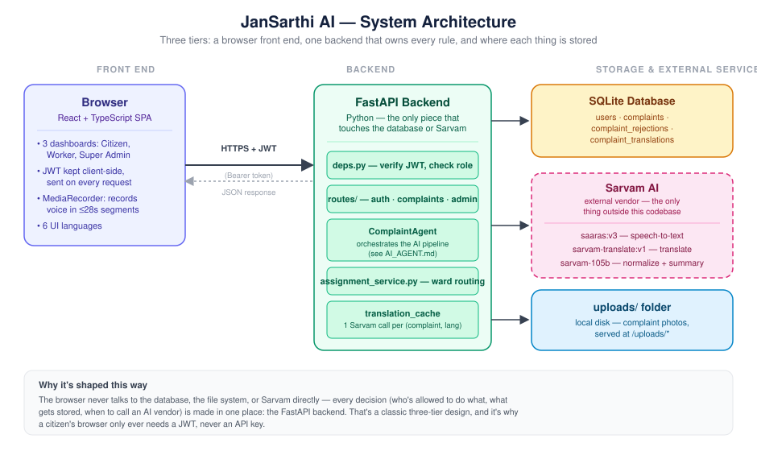
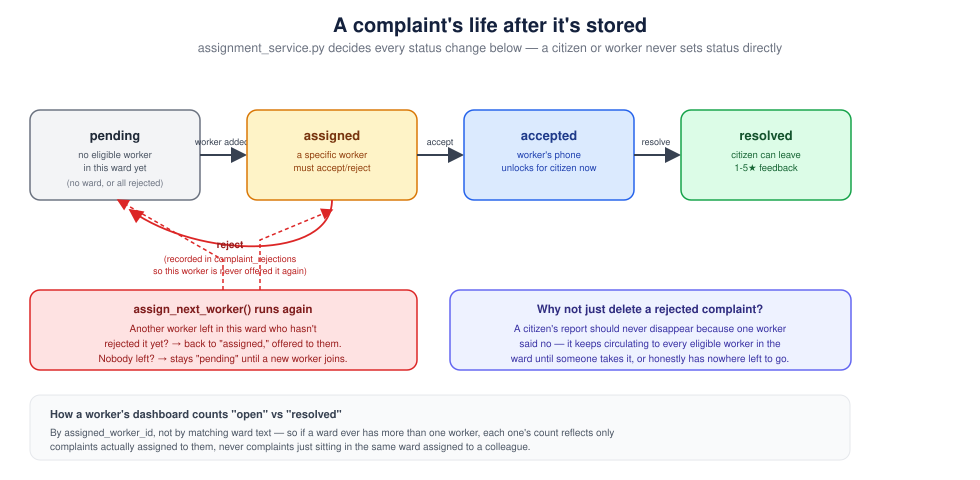

# JanMitra AI — Project Overview

*A ground-up walkthrough of what this codebase is, how its pieces fit together, and what every file in it does — written for someone opening the repository for the first time, whether or not you write code.*

> Part of the JanMitra AI documentation set. See [`README.md`](../README.md) for a quick reference and setup instructions, and [`AI_AGENT.md`](AI_AGENT.md) for a deep dive specifically on the AI pipeline (speech-to-text, translation, summarization, and everything measured/learned about their real-world limits).

---

## 1. What JanMitra AI actually is

A civic complaint app — currently focused on garbage collection — built around one specific problem: **the citizen reporting a problem and the municipal worker fixing it often don't speak the same language.**

In most Indian towns and cities, a citizen might be most comfortable speaking Marathi or Hindi, while the sanitation worker or ward office might work primarily in a different language — or the other way around. Ordinary complaint apps assume everyone involved shares one language. JanMitra AI doesn't: a citizen speaks or types a complaint in *their* language, and the app automatically translates it so a worker can read it in *theirs* — with no manual translation step for either person.

Under the hood it's a fairly conventional web app — a database, a backend API, a browser-based frontend — with one added ingredient: every complaint passes through a small pipeline of AI calls (speech-to-text, spelling cleanup, translation, summarization) provided by **Sarvam AI**, an Indian AI company that specializes in Indian-language models. That pipeline is covered in full in [`AI_AGENT.md`](AI_AGENT.md); this document covers everything else, plus how that pipeline fits into the whole.

### The three kinds of people who use it

| Role | Who they are | What they can do | How their account is created |
|---|---|---|---|
| **Citizen** | A resident reporting a problem | Submit complaints (voice or text), attach a photo, pick their ward, see their own complaints and track their status | Signs up themselves, anytime, on the app |
| **Worker** | Sanitation staff responsible for one ward | See every complaint assigned to them in their ward, accept or reject an assignment, mark complaints resolved | Created only by a Super Admin — cannot self sign up |
| **Super Admin** | Municipal office overseeing all wards | See every worker and their workload (open/resolved counts), create new worker accounts | Seeded directly into the database via a command-line script — never created through the app itself |

That last row is deliberate, not an oversight: there is no button, form, or API endpoint anywhere in this codebase that can create a Super Admin. The very first admin account for a real deployment is planted straight into the database by whoever is setting the system up.

---

## 2. System architecture



**What this shows:** the browser talks to exactly one thing — the FastAPI backend — over HTTPS, proving who it is with a signed token (a JWT, explained in [§6](#6-authentication-how-login-actually-works)) on every request. The backend is the only piece that talks to the database, to Sarvam AI, or to the folder of saved photos; the browser never reaches any of those directly.

**Why it's shaped this way:** this is a classic three-tier shape — a **frontend** (what you see and click), a **backend** (the rules and logic, and the only piece allowed to touch the database), and **storage** (the database and the photo folder). The browser is never trusted with direct database access or an AI API key — it only ever talks to the backend, and the backend decides what's allowed based on who is logged in.

Sarvam AI sits outside the box marked "this codebase" because it's a separate company's service, reached over the internet with an API key — same idea as a weather app calling a weather service instead of running its own weather satellites.

---

## 3. The database, explained

Four tables, all defined in [`backend/models.py`](../backend/models.py). No migration framework exists for this project (see [§9](#9-a-known-limitation-no-database-migrations)) — the app creates whatever tables are missing on startup, but never alters an existing table, which matters if you're adding a new field yourself.

- **`users`** — every account: citizens, workers, and admins all live in the same table, distinguished by a `role` column. Workers additionally have a `ward`; citizens and admins don't use that field.
- **`complaints`** — the core record. Stores the complaint in two forms at once: `original_text` (exactly what the citizen wrote or said, in their own language, never altered) and `translated_text` (the canonical English version everything else is derived from). Also carries `status` (see the lifecycle diagram below), `ward`, and which worker it's assigned to.
- **`complaint_rejections`** — one row per (complaint, worker) pair where that worker rejected that complaint. Exists so a rejected complaint never gets re-offered to the same worker when it's reassigned.
- **`complaint_translations`** — a cache: the complaint's English text/summary translated into one specific other language, computed once and reused on every later view in that language, instead of calling Sarvam again on every single read. See [`AI_AGENT.md §3.5`](AI_AGENT.md#35-translation-caching-not-part-of-the-ai-pipeline-itself-but-related).

---

## 4. How a complaint moves through the system



A complaint is never manually set to a status by a citizen or worker clicking something arbitrary — every status change is a *consequence* of an action (a worker accepting, rejecting, or resolving), computed by [`assignment_service.py`](../backend/services/assignment_service.py). The diagram above covers the full mechanism, including what happens when a worker rejects a complaint (it doesn't vanish — it keeps circulating to every eligible worker in the ward) and why a worker's dashboard counts are based on actual assignment, not just matching ward text (a ward can have more than one worker).

---

## 5. The backend (Python / FastAPI)

Everything under `backend/`. Read top to bottom and you're reading the request-handling stack from the outside in: entry point → routes → services → database.

| File | What it's for |
|---|---|
| `main.py` | The actual FastAPI application. Wires up CORS (which browser origins may call this API), mounts the three route groups, serves uploaded photos as static files at `/uploads`, and runs `init_db()` on startup. |
| `config.py` | Every setting the app needs — API keys, model names, the JWT secret, supported languages — read once from environment variables (via `.env`) into one `settings` object. Nothing else in the codebase reads `os.environ` directly. |
| `database.py` | Creates the SQLAlchemy engine and session factory, and `init_db()`, which creates any missing tables on startup. There is no formal migration system — schema changes just mean the app auto-creates whatever tables don't exist yet (see [§9](#9-a-known-limitation-no-database-migrations)). |
| `models.py` | The four database tables, described in [§3](#3-the-database-explained). |
| `deps.py` | Two small but load-bearing functions: `get_current_user` (reads a JWT from the request and resolves it to a real user, or rejects the request) and `require_role(...)` (builds a check that only lets specific roles through). Almost every route depends on one of these. |
| `routes/auth.py` | Sign-up, login, "who am I," and profile updates. Sign-up always creates a citizen — this file has no code path that can create anything else. |
| `routes/admin.py` | Super-admin-only: create a worker account, list all workers with their open/resolved complaint counts. Every route here is gated by `require_role("admin")`. |
| `routes/complaints.py` | The heart of the app: create a complaint (text or chunked voice, see [`AI_AGENT.md`](AI_AGENT.md)), list complaints (scoped by the caller's role), accept/reject/resolve, leave feedback, and list which wards have a worker (backs the citizen's ward picker dropdown). |
| `services/sarvam_client.py` | The one place that calls Sarvam's speech-to-text and translation APIs directly. Defines `AIServiceError`, the exception every AI failure eventually turns into. |
| `services/translation_service.py` | A thin, readable wrapper around `sarvam_client`'s `translate()`: `to_english()`/`to_language()`, so the rest of the code never has to think in Sarvam's language-code format directly. |
| `services/normalization_service.py` | Spelling cleanup, run in the citizen's own language before translation. Never raises — falls back to the original text on any failure, since this is a quality nicety, not a required step. See [`AI_AGENT.md §3.2`](AI_AGENT.md#32-normalize--fixing-typos-before-anything-else-happens). |
| `services/summary_service.py` | Generates the short English summary via a Sarvam chat-completion call. See [`AI_AGENT.md §3.4`](AI_AGENT.md#34-summarize--the-short-version). |
| `services/complaint_agent.py` | `ComplaintAgent` — orchestrates the whole pipeline for one complaint: transcribe (if voice, in chunks) → normalize → translate → summarize → save. The class both the route and the tests call; it doesn't know or care whether the caller is a real HTTP request or a test. Full write-up: [`AI_AGENT.md`](AI_AGENT.md). |
| `services/complaint_translation_cache.py` | Looks up or computes-and-caches a complaint's (text, summary) pair in a requested display language. See [§3.5 of AI_AGENT.md](AI_AGENT.md#35-translation-caching-not-part-of-the-ai-pipeline-itself-but-related). |
| `services/assignment_service.py` | Decides which worker (if any) a complaint should be assigned to, and reassigns it on rejection. The single source of truth for `status` and `assigned_worker_id`. |
| `services/auth_service.py` | Password hashing (bcrypt) and JWT session tokens, implemented against Python's standard library directly (HS256 only) rather than pulling in a third-party JWT package, since the app only ever needs to issue and verify its own tokens. |
| `prompts/*.txt` | The literal text sent to the AI models as instructions — kept as plain files, not hardcoded strings, so a prompt can be tweaked without touching Python code. |
| `scripts/*.py` | One-off command-line scripts: seeding the first Super Admin account, migrating older complaints to have `assigned_worker_id` set, generating/rebuilding the 6-language UI translation file, seeding realistic multi-ward test data. None of these run as part of the app itself — they're run manually, once, when needed. |

---

## 6. Authentication: how login actually works

No sessions, no server-side login state — this app uses **JWTs** (JSON Web Tokens), a compact, signed piece of text the server hands the browser on login, which the browser then sends back on every subsequent request to prove who it is.

1. You log in with a phone number and password. The backend checks your password against a stored **hash** (never the plaintext password itself — see `hash_password`/`verify_password` in `auth_service.py`) and, if it matches, creates a JWT containing your user ID and role, signed with a secret key only the backend knows.
2. The browser stores that token (in `localStorage`, see `frontend-react/src/lib/auth.tsx`) and attaches it as an `Authorization: Bearer <token>` header on every API call from then on.
3. On each request, `deps.get_current_user` verifies the token's signature (proving it wasn't tampered with) and expiry (tokens last 24 hours by default — `JWT_EXPIRE_MINUTES`), then looks up the real user it refers to.
4. `require_role(...)` builds on top of that to reject anyone whose role doesn't match what a specific route needs — e.g., only a citizen can create a complaint, only an admin can create a worker.

If the JWT secret key isn't explicitly set (`JWT_SECRET_KEY` in `.env`), the app generates a random one for that process run — meaning every restart invalidates every previously-issued token. Fine for local development; a real deployment should set this explicitly.

---

## 7. The frontend (React + TypeScript)

Everything under `frontend-react/src/`. React apps are built from small, focused files — this one splits cleanly into **pages** (one per screen), **components** (reusable pieces used across pages), and **lib** (logic that isn't a visual thing at all: talking to the API, remembering who's logged in, etc.).

### Entry point & routing

| File | What it's for |
|---|---|
| `main.tsx` | The actual entry point — calls `createRoot(...).render(...)` to boot React into the page. Wraps the whole app in four "providers" (theme, router, UI language, auth) so every page below can use them. |
| `App.tsx` | The route table: which URL path shows which page, and which pages require which role logged in (via `ProtectedRoute`). |

### Pages — one per screen

| File | Route | Who sees it | What it does |
|---|---|---|---|
| `LanguageGate.tsx` | `/` | Anyone | The very first screen: pick a UI language (this is the app's *own* interface language, chosen once up front — separate from what language a complaint gets submitted in). |
| `Landing.tsx` | `/welcome` | Anyone | Marketing-style landing page with a headline and buttons to log in or sign up. |
| `Login.tsx` | `/login` | Anyone | Phone + password form. On success, redirects to whichever dashboard matches the logged-in user's role. |
| `Signup.tsx` | `/signup` | Anyone | Name + phone + password form — always creates a citizen account, and explicitly tells sanitation workers to ask their admin for a login instead of signing up here. |
| `CitizenDashboard.tsx` | `/citizen` | Citizen | The complaint form (type or speak, pick a language, pick a ward, attach a photo) plus a list of the citizen's own past complaints with live status tracking. |
| `WorkerDashboard.tsx` | `/worker` | Worker | The queue of complaints assigned to this worker, with accept/reject/resolve actions. |
| `AdminDashboard.tsx` | `/admin` | Super Admin | Every worker across every ward, with their open/resolved counts, and a button to add a new worker. |

### Components — reusable pieces

| File | What it's for |
|---|---|
| `ProtectedRoute.tsx` | Wraps a page so it redirects to `/login` if you're not authenticated, or somewhere sensible if you're logged in as the wrong role. |
| `TopBar.tsx` | The header shown on every logged-in page: current role, settings, logout. |
| `SettingsModal.tsx` | Change your display name or preferred language from any dashboard. |
| `AddWorkerModal.tsx` | The form a Super Admin fills in to create a new worker account. |
| `ThemeToggle.tsx` | Light/dark/system theme switch. |
| `ComplaintTracker.tsx` | The horizontal step tracker (submitted → assigned → in progress → resolved) shown on each of a citizen's complaints, including a distinct "searching for another worker" state after a rejection. |

### `lib/` — logic, not visuals

| File | What it's for |
|---|---|
| `api.ts` | Every backend call the frontend makes, in one place, with TypeScript types matching the backend's response shapes. |
| `auth.tsx` | Holds the logged-in user and JWT in React context; persists the token in `localStorage` so a page refresh doesn't log you out. See [§6](#6-authentication-how-login-actually-works). |
| `useAudioRecorder.ts` | Records a citizen's voice complaint via the browser's `MediaRecorder` API, in ≤28-second segments (see [`AI_AGENT.md §3.1`](AI_AGENT.md#31-speech-to-text-stt--turning-a-voice-recording-into-text)) — the single most technically involved piece of the frontend. |
| `i18n.ts` | Every piece of UI text (not complaint content — the app's own buttons/labels), in 6 languages: English, Hindi, Marathi, Odia, Gujarati, Bengali. |
| `uiLang.tsx` | Which of those 6 languages the interface itself is currently shown in. |
| `theme.tsx` | Light/dark/system theme state. |

---

## 8. Real, measured AI limits (summary — full detail in AI_AGENT.md)

Everything AI-related — how speech-to-text, spelling cleanup, translation, and summarization actually work, and the real limits found by testing against the live API rather than guessing — is covered in full in **[`AI_AGENT.md`](AI_AGENT.md)**. The two headline facts:

- Voice recordings are capped at 30 seconds *per request* by Sarvam's API (confirmed live) — worked around by splitting longer recordings into chunks client-side, never by the citizen having to know about the limit.
- There is no clean word-count "safe zone" for the text-cleanup/summarization steps — reliability depends on the AI model's unpredictable internal "thinking" time per call, not on input length. Every AI step in this app is built to degrade gracefully (fall back to a simpler result) rather than block a complaint from being saved.

---

## 9. A known limitation: no database migrations

Worth being upfront about, since it'll surprise anyone used to a framework like Django or Rails: this project has **no migration system**. `database.py`'s `init_db()` calls `Base.metadata.create_all()`, which creates tables that don't exist yet — but if you add a new column to an *existing* table (say, `Complaint`), nothing automatically adds that column to a database file that already has data in it. The two options, both used already in this codebase (see `scripts/migrate_assignment_tracking.py` for an example), are: write a small one-off script that runs an `ALTER TABLE`, or, for local development, just delete `janmitra.db` and let it recreate from scratch.

---

## 10. Running it yourself

See [`README.md`](../README.md) for full setup steps (environment variables, installing dependencies, starting both servers). In short:

```bash
# Backend
python -m uvicorn backend.main:app --reload

# Frontend
cd frontend-react && npm run dev
```

The very first Super Admin account for a fresh database is created by running `scripts/seed_admin.py` directly, not through the app.

## 11. Testing

```bash
pytest tests/ -v                              # backend — mocks all external AI calls
cd frontend-react && npx playwright test      # end-to-end, against real running dev servers
```

The end-to-end tests need both the backend and frontend dev servers actually running first (see [§10](#10-running-it-yourself)) — unlike the backend's own `pytest` suite, they're not self-contained.

---

*Related reading: [`README.md`](../README.md) for setup, [`AI_AGENT.md`](AI_AGENT.md) for the AI pipeline deep dive.*
